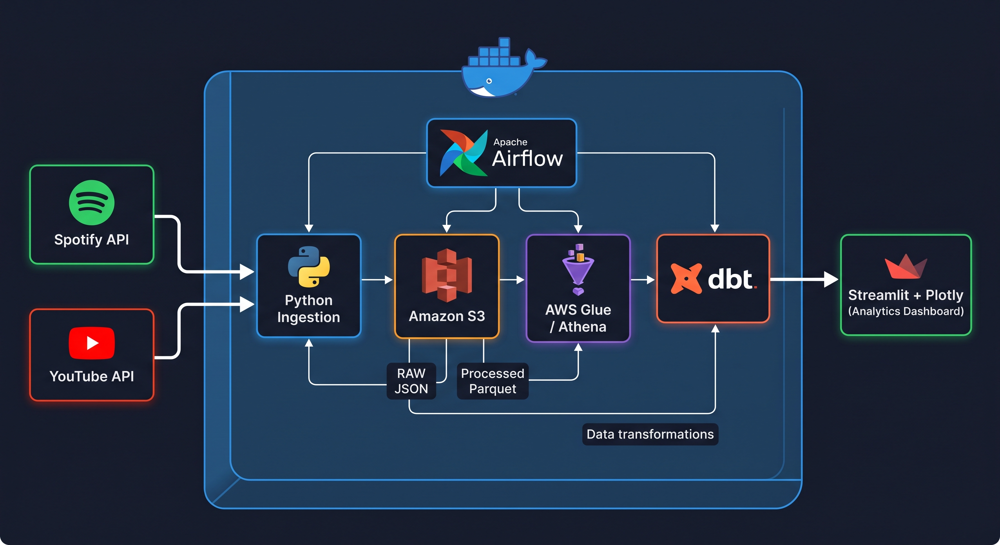

# Avenged Sevenfold Music Performance Analytics

An end-to-end Data Engineering project that builds a cloud-based analytics platform for **Avenged Sevenfold (A7X)** using Spotify and YouTube data.

**[🚀 Live Dashboard](https://a7x-performance-analytics.streamlit.app/)**

The project demonstrates a production-oriented data pipeline covering API ingestion, historical snapshots, AWS data lake architecture, transformation with dbt, orchestration with Airflow, data quality validation, and an interactive analytics dashboard.

<p align="center">
  
</p>

---

## Project Overview

This project analyzes the digital performance of Avenged Sevenfold's music by combining:

* **Spotify** for song, album, and catalog metadata
* **YouTube** for video performance metrics
* **Amazon S3** for raw and processed data storage
* **AWS Glue / Athena** for serverless data discovery and querying
* **dbt** for analytical transformations and data modeling
* **Apache Airflow** for pipeline orchestration
* **Streamlit + Plotly** for visualization and analytics

The pipeline is designed to preserve historical YouTube performance snapshots so that song growth can be analyzed over time rather than only looking at the latest values.

---

## Business Objective

The objective is to build a reusable music analytics platform that can answer questions such as:

* Which A7X songs have the highest YouTube view counts?
* Which songs are gaining views the fastest?
* How does song performance change over time?
* Which songs receive the most likes and comments relative to their views?
* How does performance differ between albums?
* How can Spotify catalog information and YouTube performance data be integrated into a unified analytical model?
* Can historical snapshots be used to measure the growth trajectory of individual songs?

The project is primarily focused on demonstrating **Data Engineering architecture and analytical modeling**, rather than building a complete music recommendation system.

---

## Current Project Status

| Component                           | Status        |
| ----------------------------------- | ------------- |
| Song catalog                        | ✅ Complete    |
| Spotify matching                    | ✅ 89/89 songs |
| YouTube matching                    | ✅ 89/89 songs |
| S3 data lake                        | ✅ Complete    |
| Raw API ingestion                   | ✅ Complete    |
| Historical YouTube snapshots        | ✅ Complete    |
| AWS Glue / Athena                   | ✅ Complete    |
| dbt transformations                 | ✅ Complete    |
| Airflow orchestration               | ✅ Complete    |
| Data quality validation             | ✅ Complete    |
| Incremental / idempotent processing | ✅ Complete    |
| Streamlit dashboard                 | ✅ Complete    |
| Historical growth analysis          | ✅ Complete    |

Current historical dataset:

* **89 songs**
* **3 ingestion snapshots**
* **267 historical records**

Example snapshot dates:

```text
2026-09-18
2026-09-22
2026-09-23
```

As the pipeline continues to run, additional snapshots can be accumulated for longer-term trend analysis.

---

# Architecture

```text
                    ┌─────────────────────┐
                    │     Spotify API     │
                    │                     │
                    │ Track / Album Data  │
                    └──────────┬──────────┘
                               │
                               │
                               ▼
                    ┌─────────────────────┐
                    │                     │
                    │  Python Ingestion   │
                    │                     │
                    └──────────┬──────────┘
                               │
                               │
                    ┌──────────▼──────────┐
                    │                     │
                    │    YouTube API      │
                    │                     │
                    │ Views / Likes /     │
                    │ Comments / Metadata │
                    └──────────┬──────────┘
                               │
                               ▼
                    ┌─────────────────────┐
                    │     Amazon S3       │
                    │                     │
                    │   RAW JSON          │
                    │   Processed Parquet │
                    └──────────┬──────────┘
                               │
                               ▼
                    ┌─────────────────────┐
                    │ AWS Glue / Athena   │
                    │                     │
                    │ Data Catalog & SQL  │
                    └──────────┬──────────┘
                               │
                               ▼
                    ┌─────────────────────┐
                    │        dbt          │
                    │                     │
                    │ Staging             │
                    │ Intermediate        │
                    │ Dimensions          │
                    │ Facts               │
                    │ Historical Growth   │
                    └──────────┬──────────┘
                               │
                               ▼
                    ┌─────────────────────┐
                    │ Streamlit + Plotly  │
                    │                     │
                    │ Analytics Dashboard │
                    └─────────────────────┘

                    Apache Airflow
                    orchestrates
                    the pipeline
```

---

# Data Sources

## Spotify

Spotify is used primarily as the **music catalog and metadata source**.

The project retrieves information such as:

* Artist
* Album
* Song
* Track ID
* Album ID
* Track number
* Release date
* Version information

Spotify is also used to establish consistent identifiers and metadata for the music catalog.

### Spotify API Limitation

Spotify popularity is **not currently included in the analytical layer** of this project because the API data used by the pipeline does not provide a usable popularity field for the current implementation.

Therefore, Spotify popularity is intentionally **not displayed in the dashboard or used in analytical models**.

---

## YouTube

YouTube is the primary source for **music performance metrics**.

The pipeline collects:

* Video ID
* Video title
* Channel
* Publication date
* View count
* Like count
* Comment count
* Content type

The project focuses on official Avenged Sevenfold content from:

* Avenged Sevenfold official artist channel
* Avenged Sevenfold - Topic channel

---

# Music Catalog

The current catalog contains:

**89 Avenged Sevenfold songs**

The catalog includes songs from:

* Sounding the Seventh Trumpet
* Waking the Fallen
* City of Evil
* Avenged Sevenfold
* Nightmare
* Hail to the King
* The Stage
* Life Is but a Dream...

The catalog acts as the reference dataset used to match Spotify and YouTube records.

---

# YouTube Song Matching

A major part of the ingestion process is matching catalog songs against official YouTube uploads.

The matching process considers:

* Song title
* Artist name
* Album information where available
* YouTube channel
* Video title patterns
* Content type
* Excluded keywords for non-performance content

The current result is:

```text
Catalog songs       : 89
YouTube matched      : 89
YouTube not matched  : 0
Match rate           : 100%
```

This ensures that the analytical layer has a consistent relationship between the music catalog and YouTube performance data.

---

# AWS Data Lake

Amazon S3 is used as the project's primary data lake storage layer.

The data is separated into raw and processed layers.

Example structure:

```text
s3://tsabitul-a7x-music-analytic/

├── raw/
│   └── youtube/
│       ├── 2026-09-18/
│       │   └── youtube_videos.json
│       ├── 2026-09-22/
│       │   └── youtube_videos.json
│       └── 2026-09-23/
│           └── youtube_videos.json
│
├── processed/
│   └── youtube/
│       ├── 2026-09-18/
│       │   └── youtube_video_mapping.parquet
│       ├── 2026-09-22/
│       │   └── youtube_video_mapping.parquet
│       └── 2026-09-23/
│           └── youtube_video_mapping.parquet
│
└── athena-results/
```

Historical data is partitioned by ingestion date so that every pipeline execution can preserve a point-in-time snapshot.

---

# Data Processing Layers

The project follows a layered data architecture.

## Raw Layer

Stores API responses with minimal modification.

Format:

```text
JSON
```

Purpose:

* Preserve source data
* Enable reprocessing
* Maintain ingestion history
* Provide traceability

---

## Processed Layer

Transforms raw API responses into structured analytical files.

Format:

```text
Parquet
```

Benefits:

* Columnar storage
* Efficient analytical queries
* Reduced storage size
* Better compatibility with Athena

---

## Analytics Layer

AWS Athena provides SQL access to the processed data.

dbt then transforms the data into analytical models.

---

# dbt Data Model

The dbt project follows a layered modeling approach.

### Staging

```text
stg_spotify_tracks
stg_youtube_videos
```

Staging models standardize source data types and column names.

---

### Intermediate

```text
int_song_performance
```

Combines and prepares source data for downstream analytical models.

---

### Dimensions

```text
dim_album
dim_song
```

These models provide reusable descriptive entities for analytical queries.

---

### Fact Models

```text
fact_music_performance
fct_album_performance_summary
fct_song_performance_summary
```

These models provide aggregated and analytical views of music performance.

---

### Historical Models

```text
fct_music_performance_history
fct_song_growth
```

These models enable time-series analysis of YouTube performance.

---

# Historical Performance

A key feature of this project is that YouTube metrics are stored as **historical snapshots**.

Instead of replacing the previous values every time the pipeline runs, each ingestion creates a new snapshot.

The historical grain is:

```text
song_id + ingestion_date
```

For example:

```text
song_id | ingestion_date | view_count
--------|----------------|-----------
...     | 2026-09-18     | ...
...     | 2026-09-22     | ...
...     | 2026-09-23     | ...
```

This allows the project to analyze how individual songs change over time.

---

# Growth Analytics

The `fct_song_growth` model uses SQL window functions to compare each snapshot with the previous snapshot.

For each song, the model calculates:

* Previous view count
* Previous like count
* Previous comment count
* Previous ingestion date
* Days since previous snapshot
* View growth
* View growth percentage
* Like growth
* Comment growth
* Average daily view growth

### View Growth

```text
view_growth =
current_view_count - previous_view_count
```

### View Growth Percentage

```text
view_growth_pct =
view_growth / previous_view_count
```

### Average Daily View Growth

```text
avg_daily_view_growth =
view_growth / days_since_previous_snapshot
```

Average daily growth is particularly useful because the ingestion intervals are not necessarily identical.

For example:

```text
2026-09-18 → 2026-09-22 = 4 days
2026-09-22 → 2026-09-23 = 1 day
```

Comparing raw view growth without accounting for the number of days between snapshots could therefore be misleading.

---

# Engagement Rate

The project defines a custom YouTube engagement metric:

```text
Engagement Rate =
(Likes + Comments) / Views
```

For example:

```text
Views     = 100,000
Likes     = 3,000
Comments  = 200

Engagement =
3,000 + 200
= 3,200

Engagement Rate =
3,200 / 100,000
= 3.2%
```

This metric measures audience interaction relative to the number of views.

It provides a different perspective from total views:

* **Views** indicate overall reach.
* **Likes and comments** indicate measurable interaction.
* **Engagement rate** normalizes interaction relative to views.

This is a **project-specific analytical definition** and should not be interpreted as a universal YouTube definition of engagement rate.

---

# Dashboard

The project includes an interactive **Streamlit + Plotly dashboard**.

**[🚀 Open the Live Dashboard](https://a7x-performance-analytics.streamlit.app/)**

The dashboard provides several analytical views.

## Overview

Provides a high-level summary of the music catalog and performance dataset.

---

## Song Analysis

Allows users to explore individual songs and their YouTube performance.

Metrics include:

* Views
* Likes
* Comments
* Engagement
* Engagement rate
* Song metadata

---

## Album Analysis

Provides album-level performance analysis, including aggregated song performance.

---

## Growth Analysis

Provides historical performance analysis using the snapshot data.

Features include:

* Latest snapshot KPIs
* Total views gained
* Average daily views gained
* Number of songs with positive growth
* Total views over time
* Fastest-growing songs
* Highest growth-rate songs
* Selected song historical view trends
* Historical growth table

Growth rankings use **average daily view growth** where appropriate to account for irregular snapshot intervals.

---

## Data Quality

The dashboard also provides visibility into data quality and pipeline results.

---

# Data Quality

The project includes validation at different stages of the pipeline.

Examples include:

* Song ID consistency
* YouTube matching validation
* Required field validation
* Duplicate detection
* Historical snapshot validation
* Null checks
* Referential integrity
* Expected record counts

The current YouTube matching validation confirms:

```text
89 catalog songs
89 matched YouTube records
0 unmatched songs
```

---

# Pipeline Orchestration

Apache Airflow is used to orchestrate the pipeline.

The orchestration layer manages tasks such as:

```text
Catalog
   ↓
API ingestion
   ↓
Raw S3 storage
   ↓
Transformation
   ↓
Processed S3 storage
   ↓
Athena / Glue
   ↓
dbt transformations
   ↓
Data quality validation
   ↓
Analytics-ready data
```

Airflow allows the pipeline to be executed repeatedly and provides a foundation for scheduled data collection.

---

# Incremental and Idempotent Processing

The pipeline is designed to support repeated execution without unnecessarily overwriting historical snapshots.

YouTube data is stored using ingestion dates:

```text
raw/youtube/<ingestion_date>/
processed/youtube/<ingestion_date>/
```

This provides:

* Historical preservation
* Reproducibility
* Incremental data collection
* Easier debugging
* Point-in-time analysis

The historical models then use these snapshots to calculate growth.

---

# Technology Stack

| Category         | Technology       |
| ---------------- | ---------------- |
| Programming      | Python           |
| Query Language   | SQL              |
| Source API       | Spotify API      |
| Source API       | YouTube Data API |
| Orchestration    | Apache Airflow   |
| Object Storage   | Amazon S3        |
| Data Catalog     | AWS Glue         |
| Query Engine     | Amazon Athena    |
| Transformation   | dbt              |
| Data Format      | JSON / Parquet   |
| Dashboard        | Streamlit        |
| Visualization    | Plotly           |
| Containerization | Docker           |
| Cloud            | AWS              |
| Version Control  | Git / GitHub     |

---

# Repository Structure

```text
a7x_performance_analytics/
│
├── catalog/
│   └── a7x_catalog.csv
│
├── dags/
│   └── ...
│
├── data/
│   └── ...
│
├── dbt/
│   └── a7x_analytics/
│       ├── models/
│       │   ├── staging/
│       │   ├── intermediate/
│       │   ├── dimensions/
│       │   └── facts/
│       └── ...
│
├── dashboard/
│   ├── app.py
│   ├── queries.py
│   └── requirements.txt
│
├── src/
│   ├── spotify.py
│   ├── youtube.py
│   ├── transform.py
│   └── ...
│
├── tests/
│   └── validate_catalog.py
│
├── .env
├── data_requirement.txt
├── docker-compose.yml
├── README.md
└── ...
```

---

# Security

API credentials and AWS credentials are not stored directly in the source code.

Environment variables are used for sensitive configuration.

Example:

```text
SPOTIFY_CLIENT_ID
SPOTIFY_CLIENT_SECRET
YOUTUBE_API_KEY
AWS_ACCESS_KEY_ID
AWS_SECRET_ACCESS_KEY
```

The `.env` file should not be committed to Git.

A `.gitignore` file should exclude sensitive configuration files.

---

# Limitations

The current project has several limitations.

### Historical depth

The current historical dataset contains only three snapshots.

Longer-term trend analysis will become more meaningful as additional scheduled snapshots are collected.

### API dependency

The pipeline depends on the availability and behavior of external APIs.

Changes to API limits, schemas, authentication, or access policies may require pipeline updates.

### YouTube metrics

YouTube metrics represent the performance of the matched videos and may not represent every possible version, upload, or re-upload of a song.

### Spotify data

Spotify is currently used primarily for catalog and track metadata.

Spotify popularity is not part of the current analytical model.

### Cross-platform interpretation

Spotify catalog metadata and YouTube performance metrics represent different aspects of a song's digital presence.

They should therefore be interpreted according to their respective data sources rather than treated as directly equivalent measurements.

---

# Future Enhancements

Potential future improvements include:

* Longer historical data collection
* Automated anomaly detection
* More detailed YouTube content classification
* Additional YouTube metrics
* Cross-platform analytics using additional data sources
* Automated data quality reporting
* Cloud-native Airflow deployment
* Infrastructure as Code using Terraform
* CI/CD for dbt and pipeline validation
* More advanced song and album trend analysis
* Automated dashboard deployment

---

# Success Criteria

The project successfully demonstrates the following Data Engineering capabilities:

### Data ingestion

* Consume multiple external APIs
* Handle API authentication
* Match source records to a reference catalog

### Data lake architecture

* Store raw API responses
* Store processed analytical data
* Preserve historical snapshots
* Use partitioned S3 paths

### Cloud data engineering

* Amazon S3
* AWS Glue
* Amazon Athena

### Data transformation

* Python
* SQL
* dbt
* Dimensional modeling
* Fact and dimension tables
* Historical analytical models

### Orchestration

* Apache Airflow
* Repeatable pipeline execution
* Incremental processing

### Data quality

* Record validation
* Matching validation
* Null and duplicate checks
* Referential integrity

### Analytics

* Historical growth analysis
* Engagement analysis
* Song-level analysis
* Album-level analysis

### Visualization

* Streamlit
* Plotly
* Interactive analytical dashboard

---

# Key Takeaways

This project demonstrates an end-to-end Data Engineering workflow:

```text
External APIs
     ↓
Python ingestion
     ↓
Amazon S3
     ↓
AWS Glue / Athena
     ↓
dbt
     ↓
Analytical data models
     ↓
Streamlit + Plotly
```

The project goes beyond simply extracting API data by implementing:

* A structured music catalog
* Cross-source entity matching
* Cloud data lake storage
* Historical snapshots
* Analytical fact and dimension models
* Growth calculations using SQL window functions
* Data quality validation
* Incremental and idempotent processing
* Orchestration with Airflow
* Interactive business-oriented analytics

The result is a reusable architecture that can be extended beyond Avenged Sevenfold to other artists, music catalogs, or similar API-driven analytics use cases.
